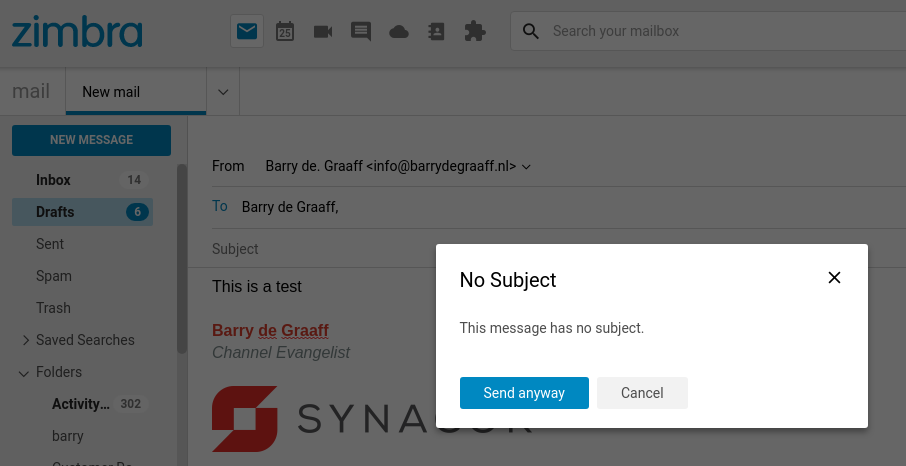

# Empty Subject Zimlet

This article explains how to write a Zimlet that listens for an event using zimletEventEmitter. This particular Zimlet listens for the `ONSEND` event and warns the user in case the Subject field is empty..

## Downloading and running the Empty Subject Zimlet

Create a folder on your local computer to store the Empty Subject Zimlet:

      mkdir ~/zimbra_course_pt17
      cd ~/zimbra_course_pt17
      git clone https://github.com/Zimbra/zimbra-zimlet-emptysubject
      cd zimbra-zimlet-emptysubject
      npm install
      zimlet watch

The output of this command should be:

```
Compiled successfully!

You can view the application in browser.

Local:            https://localhost:8081/index.js
On Your Network:  https://192.168.1.100:8081/index.js
```

Visit https://localhost:8081/index.js in your browser and accept the self-signed certificate. The index.js is a packed version of the `Empty Subject Zimlet`. More information about the zimlet command, npm and using SSL certificates can be found in https://github.com/Zimbra/zm-zimlet-guide. 

Have you already used Zimlet Cli in the past? Make sure to update it using `sudo npm install -g @zimbra/zimlet-cli`. You can check your version using `zimlet --version`. You will need version `12.8.0` of Zimlet Cli for this Zimlet to work.

## Sideload the Empty Subject Zimlet

Log on to your Zimbra development server and make sure that you are seeing the modern UI. Then click the Jigsaw puzzle icon and Zimlets Sideloader. If you are not seeing the Zimlet Sideloader menu. You have to run `apt/yum install zimbra-zimlet-sideloader` on your Zimbra server and enable the Sideloader Zimlet in your Class of Service.

> 
*Sideload the Empty Subject Zimlet by clicking Load Zimlet. The Zimlet is now added to the Zimbra UI in real-time. No reload is necessary.*

Write a new email and put something in the body of the email. Do not fill the Subject field and click Send. You will then see the new Empty Subject Zimlet in action.

> 
*The Empty Subject Alert*

## zimletEventEmitter events 

Zimlets can register listeners that are provided via zimletEventEmitter. The following events are supported:

- AFTERONSEND
- LOGOUT
- ONSEND
- ONSENDINVITEREPLY

_New events will be added to Zimbra soon, this guide will be updated when that happens._

After the user clicks the send button and when all `ONSEND` event handlers have resolved, the `AFTERONSEND` event is fired. At this point the back-end will process the email for sending. This event can not abort the sending, so it should always resolve. This event can be used for compliance, custom logging or custom REST API calls.

The `LOGOUT` event is fired when the user clicks the `Logout` menu item. It can be used to trigger a log-out in non Single Log Out aware 3rd party application.

The `ONSEND` event is fired when the user clicks the `Send` button when sending an email. It can be used for email error checks, such as a forgotten attachment reminder, or do a check in a 3rd party application for compliance validation.

The `ONSENDINVITEREPLY` is fired when a user RSVP's to a calendar invitation. The `verb` and `invitation` are passed to the event handler. You can use the `verb` to determine if the user accepted, declined, proposed a new time or tentatively accepted the invitation. Define your handler like: `onSendHandler = (args) => {console.log(args);}`.

There can be two types of handlers.

1. Handler doing synchronous tasks like - calculating something, displaying toast, or updating view/state. Here is an example of this kind of handler:
```
import { zimletEventEmitter } from '@zimbra-client/util';
import { ZIMBRA_ZIMLET_EVENTS } from '@zimbra-client/constants';

const onLogoutHandler = () => { /** Display toast message */ };
zimletEventEmitter.on(ZIMBRA_ZIMLET_EVENTS.LOGOUT, onLogoutHandler);
```

2. Handler doing asynchronous tasks like - invoke an API call or display a dialog to confirm the action with the user. Here is an example of this kind of handler:
```
import { zimletEventEmitter } from '@zimbra-client/util';
import { ZIMBRA_ZIMLET_EVENTS } from '@zimbra-client/constants';

const onLogoutHandler = () => new Promise((resolve, reject) => {
    if (window.confirm("Do you really want to logout?")) {
        resolve();
    } else {
        reject();
    }
});
zimletEventEmitter.on(ZIMBRA_ZIMLET_EVENTS.LOGOUT, onLogoutHandler, true);
```

## Visual Studio Code

This guides includes a fully functional `Empty Subject Zimlet`. It works by registering the `ONSEND` event. In the `onSendHandler` method the Zimlet checks if the email message has an empty subject and the Zimlet will show the user a reminder to fill out the Subject field.

To learn from this Zimlet you should open it in Visual Studio Code and take a look at the implementation of the `Empty Subject Zimlet`.

Open the folder `~/zimbra_course_pt17/zimbra-zimlet-emptysubject` in Visual Studio Code to take a look at the code in the Empty Subject Zimlet.

## Empty Subject Zimlet

The file src/index.js implements the base of the Zimlet with support for i18n:

```javascript
import { createElement } from 'preact';

import { InitializeEvents } from './components/initialize-events';

export default function Zimlet(context) {
	const { plugins } = context;
	const exports = {};

	exports.init = function init() {
		plugins.register('slot::mail-composer-toolbar-send', () => (
			<InitializeEvents context={context} />
		));
	};

	return exports;
}
```

If you have trouble understanding this code snippet please see: https://github.com/Zimbra/zm-zimlet-guide


The file src/components/initialize-events implements the onSendHandler:

```javascript
import { createElement } from 'preact';
import { useCallback, useEffect } from 'preact/hooks';

import { zimletEventEmitter, callWith } from '@zimbra-client/util';
import { ZIMBRA_ZIMLET_EVENTS } from '@zimbra-client/constants';
import ConfirmModal from './confirm-modal';

const MODAL_ID = 'zimbra-zimlet-emptysubject-dialog';

export const InitializeEvents = ({ context }) => {
	const { dispatch } = context.store;
	const { addModal } = context.zimletRedux.actions.zimlets;
	const { removeModal } = context.zimletRedux.actions.zimlets;

	const onDialogClose = useCallback(
		reject => {
			reject();
			dispatch(removeModal({ id: MODAL_ID }));
		},
		[dispatch, removeModal]
	);

	const onDialogAction = useCallback(
		resolve => {
			resolve();
			dispatch(removeModal({ id: MODAL_ID }));
		},
		[dispatch, removeModal]
	);

	const onSendHandler = useCallback(
		({ message }) =>
			new Promise((resolve, reject) => {
				// Check subject is empty or not
				if (message.subject) {
					resolve();
				} else {
					const modal = (
						<ConfirmModal
							onClose={callWith(onDialogClose, reject)}
							onAction={callWith(onDialogAction, resolve)}
						/>
					);
					dispatch(addModal({ id: MODAL_ID, modal }));
				}
			}),
		[dispatch, addModal, onDialogAction, onDialogClose]
	);

	useEffect(() => {
		zimletEventEmitter.on(ZIMBRA_ZIMLET_EVENTS.ONSEND, onSendHandler, true);

		return () => {
			zimletEventEmitter.off(ZIMBRA_ZIMLET_EVENTS.ONSEND, onSendHandler);
		};
	}, [onSendHandler]);

	return null;
};

```

Finally this Zimlet introduces a new way of creating a Modal dialog by the use of a wrapper component. This is done for increased performance. The Modal dialog wrapper is implemented in src/components/confirm-modal:

```javascript
import { createElement } from 'preact';
import { Text } from 'preact-i18n';

import { withIntl } from '../enhancers';
import { ModalDialog } from '@zimbra-client/components';

const ConfirmModal = ({ onClose, onAction }) => {
	return (
		<ModalDialog
			title="noSubject.title"
			onAction={onAction}
			onClose={onClose}
			actionLabel="noSubject.sendAnyway"
		>
			<p>
				<Text id="noSubject.description" />
			</p>
		</ModalDialog>
	);
};

export default withIntl()(ConfirmModal);
```

## React Performance: Event Handlers using `useCallback` hook.

This Zimlet introduces the use of `useCallback` to increase performance, for more information read: https://medium.com/@KTAsim/react-performance-event-handlers-using-usecallback-hook-9e4a06f8bb2f

## References

- https://github.com/Zimbra/zimlet-cli/wiki/Capture-Zimbra-events-inside-a-Zimlet
- https://medium.com/@KTAsim/react-performance-event-handlers-using-usecallback-hook-9e4a06f8bb2f

The latest version of this guide can be found at:

- https://github.com/Zimbra/zimbra-zimlet-emptysubject
